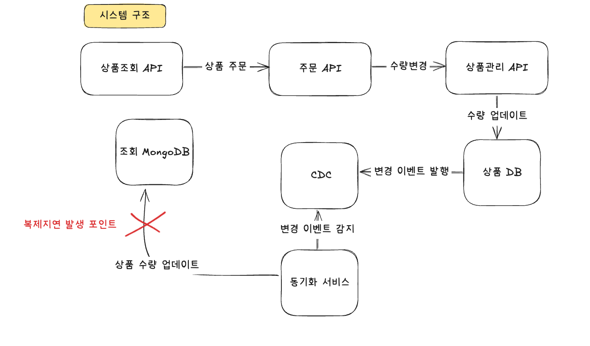
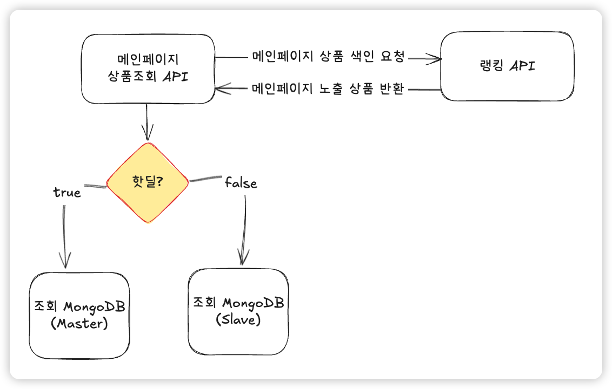
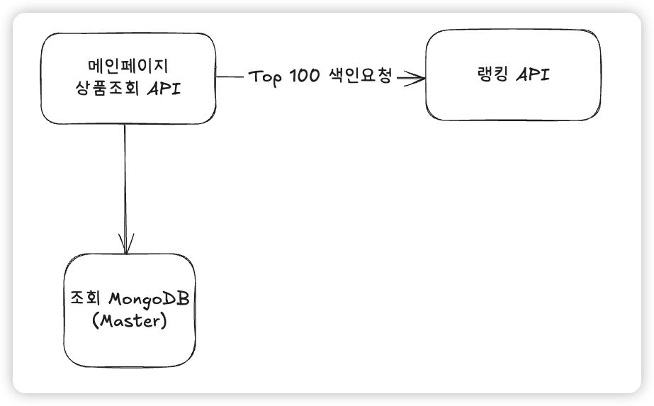
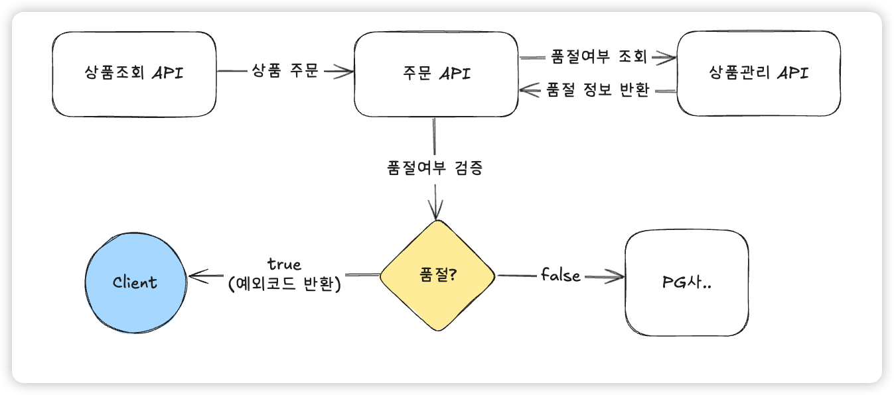

# 복제지연 문제 풀이

## 0. 문제
```angular2html
데이터베이스 구조

마스터(Master): 쓰기 전용. 모든 데이터 변경 요청(INSERT/UPDATE/DELETE)을 처리
팔로워-1(Follower-1): 읽기 전용. 마스터의 바이너리 로그(binlog)를 기반으로 비동기 복제(asynchronous replication) 수행
구성: 하나의 마스터 + 하나의 팔로워
서비스 아키텍처

상품관리 서버(Product Management Service): 상품 데이터 수정 요청 시 마스터 DB에 쓰기 요청 전송
상품조회 서버(Product Query Service): 상품 데이터 조회 요청 시 팔로워-1로 읽기 요청 전송
상황

판매자가 상품 "사과"의 재고 수량을 400 → 0으로 수정

→ 상품관리 서버가 마스터에 UPDATE 실행

→ 마스터는 binlog에 기록 후 비동기 복제를 통해 팔로워-1에 전달

상품조회 서버가 팔로워-1에서 해당 상품의 수량을 조회

→ 하지만 팔로워-1은 아직 최신 binlog를 적용하지 못함(Replication Lag 발생)

→ 조회 결과 400으로 노출

문제

판매자는 상품 재고를 0으로 설정했으나 사용자는 **잘못된 수량(400)**을 확인
비동기 복제의 특성상 쓰기 직후 일정 시간 동안 읽기 일관성이 깨짐
복제 지연이 발생했을 때 사용자가 정상적인 데이터를 전달받을 수 있는 방법은?
```


## 1. 복제지연 문제 아키텍처 재설계  - 1


위 구조로 데이터 동기화를 수행했을 때 상품 DB의 CDC 이벤트는 준실시간으로 발생하지만  
조회 MongoDB가 Master slave 구조일 때 동일하게 복제지연 문제가 발생할 수 있음  
현실적으로 대규모 이커머스 서비스라면, 모든 상품에 대한 복제지연 문제를 해결하는 것은 비현실적임  
복제지연 문제를 해결하기위해서 서비스의 전체 지연이 발생할 수 있을 것


## 2. 복제지연  문제 아키텍처 재설계 (인기상품) - 2
> 인기상품과 비인기 상품을 구분하여 인기상품이거나 핫딜 중인 상품은 Master DB에서 조회하도록 설계
> 1. 메인 페이지에 노출되는 핫딜 상품 
> 2. Top 100에 해당되는 인기상품
> 3. ????

### 2.1 메인 페이지 핫딜 조회 



- 메인페이지 상품 조회 후 특정 상품이 핫딜 상품에 포함되면 Master DB에서 상세정보 조회
- 문제! 메인페이지처럼 사용자 요청이 잦은 곳은 트래픽이 증가할 때 특정 상품만 MasterDB를 조회하는 건 지연을 유발함

### 2.2 Top 100 인기상품 조회


- Top 100 상품은 항상 Master DB 조회 
- 문제! Top 100 상품은 사용자가 자주 접근하는 페이지에 존재할 확률이 높음 위 문제처럼 지연이 발생할 확률이 높음


## 3. 결론 
- 복제지연을 100% 해결하는 방법은 마스터 DB를 조회하는 것임
  - 서비스 규모가 클수록 가용성을 위해서 Master Slave 구조를 채택할 확률이 높음
  - 이 경우 어떤 케이스에서도 복제지연을 완벽하게 해소할 수 없음
- 특정 상품만 Cache를 활용하여 수량을 제어하는 방식은?
  - 인기가 많은 상품일수록 수량이 자주 변경될 것임. 자주 변경되는 데이터를 캐시에 저장하는 것은 낭비
- 그러면 어떤 방법이 있을까? 
  - 상품 수량의 오차는 유지하고, 인기상품의 품절 여부만 안전하게 동기화되면 될 것 같음! 
  - 상품을 조회하는 페이지에선 지연 경험을 최소화하는 방식을 채택하고 주문으로 이어질 때 마스터 DB르 조회하여 판매 가능여부를 확인하는 방식  



