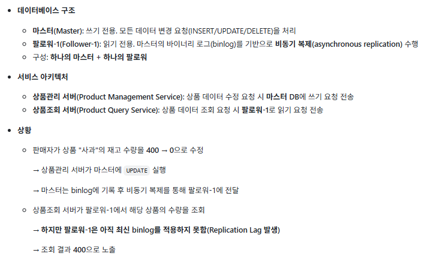
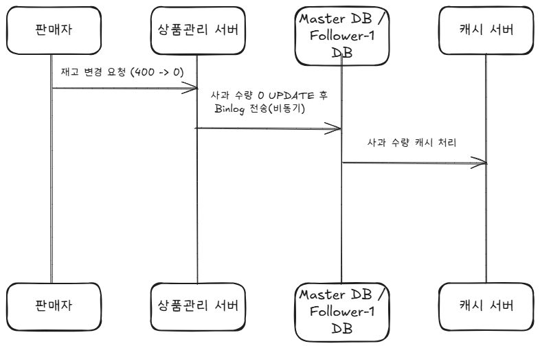

# 복제지연

## 1. 문제

- 판매자는 상품 재고를 0으로 설정했으나 사용자는 **잘못된 수량(400)**을 확인
- 비동기 복제의 특성상 쓰기 직후 일정 시간 동안 읽기 일관성이 깨짐
- 복제 지연이 발생했을 때 사용자가 정상적인 데이터를 전달받을 수 있는 방법은?

## 2. 풀이
### *캐시 서버 추가*
- 상품 재고 수정시 캐싱 처리를 통해, 사용자는 캐시된 데이터를 조회하여 혹시 모를 복제 지연 방지
- 만약 캐시 실패시 마스터 DB 조회

#### *동작 흐름*

1. 판매자가 상품 "사과" 재고 수량을 400 → 0으로 변경 요청
2. 상품관리 서버가 재고 수량 변경 요청을 마스터 DB에 UPDATE 실행
3. 마스터 DB가 데이터 변경을 반영하고 binlog에 기록
4. 변경된 최신 재고 수량(0)을 캐시 서버에 저장

- **예상되는 문제점**
  - 복제지연과 마찬가지로 예상하지 못한 캐시 실패시 마스터 DB를 조회하기 때문에 마스터 DB 부하가 증가
  - 캐시 갱신 시점은 반드시 DB 재고 수정이 일어난 후여야 데이터 일관성을 보존할 수 있음
  - 결국 캐시 서버는 완벽한 해결책이 아니기 때문에 상품을 구매할때 반드시 마스터 DB 이용 필요
  - 상품의 종류에 따라서 캐시 적용범위를 구분하는 것도 방법일 듯??

## 3. 번외 문제 풀이
1. 수평적 확장이 필요할 때, 웹서버가 상태를 가지면 안되는 이유가 무엇인가요?
   - 상태 정보가 서버에 있으면 클라이언트가 특정한 서버에 종속되기 때문에 수평적 확장의 효율성이 떨어짐
   - 서버 장애 시 사용자 세션 정보도 함께 유실되기 때문에 서비스 안정성이 떨어짐