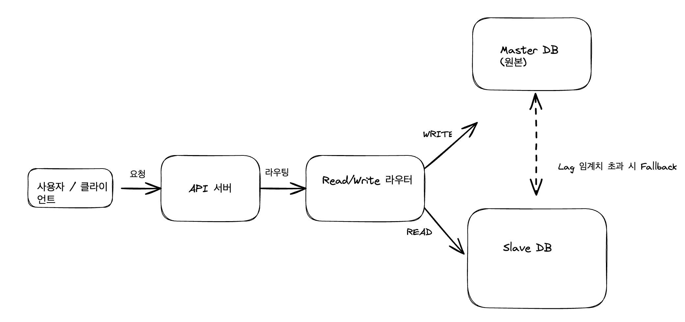

1. 문제
데이터베이스 구조

마스터(Master): 쓰기 전용. 모든 데이터 변경 요청(INSERT/UPDATE/DELETE)을 처리
팔로워-1(Follower-1): 읽기 전용. 마스터의 바이너리 로그(binlog)를 기반으로 비동기 복제(asynchronous replication) 수행
구성: 하나의 마스터 + 하나의 팔로워
서비스 아키텍처

상품관리 서버(Product Management Service): 상품 데이터 수정 요청 시 마스터 DB에 쓰기 요청 전송
상품조회 서버(Product Query Service): 상품 데이터 조회 요청 시 팔로워-1로 읽기 요청 전송
상황

판매자가 상품 "사과"의 재고 수량을 400 → 0으로 수정

→ 상품관리 서버가 마스터에 UPDATE 실행

→ 마스터는 binlog에 기록 후 비동기 복제를 통해 팔로워-1에 전달

상품조회 서버가 팔로워-1에서 해당 상품의 수량을 조회

→ 하지만 팔로워-1은 아직 최신 binlog를 적용하지 못함(Replication Lag 발생)

→ 조회 결과 400으로 노출

문제

판매자는 상품 재고를 0으로 설정했으나 사용자는 **잘못된 수량(400)**을 확인
비동기 복제의 특성상 쓰기 직후 일정 시간 동안 읽기 일관성이 깨짐
복제 지연이 발생했을 때 사용자가 정상적인 데이터를 전달받을 수 있는 방법은?

풀이
### 강제 마스터 조회
- 재고와 같이 최신성의 데이터는 master에서 조회 

### Replication Lag 모니터링 & Fallback
- Slave의 replication delay(Seconds_Behind_Master 등)를 모니터링하여 임계치 이상일 경우 Master 조회로 fallback.
- 일정 지연 이상이면 Slave 조회를 막고 Master에만 요청을 보냄.

해결방안 
- 재고/주문 같이 Critical Path 데이터 Slave가 아닌 Master 조회 
- 최신성 데이터가 아닌경우는 Slave 허용