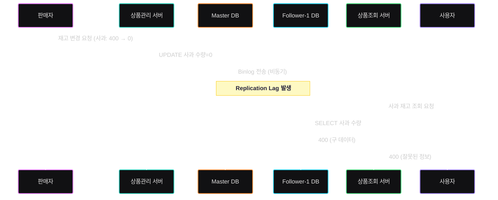

# 1주차 문제 - (복제지연)

- **데이터베이스 구조**
    - **마스터(Master)**: 쓰기 전용. 모든 데이터 변경 요청(INSERT/UPDATE/DELETE)을 처리
    - **팔로워-1(Follower-1)**: 읽기 전용. 마스터의 바이너리 로그(binlog)를 기반으로 **비동기 복제(asynchronous replication)** 수행
    - 구성: **하나의 마스터 + 하나의 팔로워**
- **서비스 아키텍처**
    - **상품관리 서버(Product Management Service)**: 상품 데이터 수정 요청 시 **마스터 DB**에 쓰기 요청 전송
    - **상품조회 서버(Product Query Service)**: 상품 데이터 조회 요청 시 **팔로워-1**로 읽기 요청 전송
- **상황**
    - 판매자가 상품 "사과"의 재고 수량을 **400 → 0**으로 수정
        
        → 상품관리 서버가 마스터에 `UPDATE` 실행
        
        → 마스터는 binlog에 기록 후 비동기 복제를 통해 팔로워-1에 전달
        
    - 상품조회 서버가 팔로워-1에서 해당 상품의 수량을 조회
        
        → **하지만 팔로워-1은 아직 최신 binlog를 적용하지 못함(Replication Lag 발생)**
        
        → 조회 결과 **400**으로 노출
        
- **문제**
    - 판매자는 상품 재고를 0으로 설정했으나 사용자는 **잘못된 수량(400)**을 확인
    - 비동기 복제의 특성상 쓰기 직후 일정 시간 동안 읽기 일관성이 깨짐
    - 복제 지연이 발생했을 때 사용자가 정상적인 데이터를 전달받을 수 있는 방법은?

## 1. 문제 원인
- Master-Slave 간 **비동기 복제**때문에 발생
- 쓰기와 읽기 경로가 분리되어 있어, 일정 시간 동안 Slave는 최신 상태가 아니기 때문에 읽기 일관성이 깨짐
- 즉, Master-Slave 구조 특성상 복제지연 발생

## 2. 해결 방안
- **모든 읽기를 Master에서 처리**
  - 가장 쉽고 단순한 방법이지만, 대규모 서비스가 Master-Slave 구조를 사용하는 핵심 이유는 **부하 분산**
  - 항상 Master에서 읽도록 구조를 변경하는 것은 좋은 선택이 아님
- **중요한 시점에만 Master 조회**
  - 읽기 일관성이 일부 깨지는 것을 감수
  - 중요한 시점(결제/주문 직전) 즉, 정확한 데이터가 필요한 시점에는 Master 조회
- **변경된 후 일정 시간동안 Master 조회**
  - 데이터가 변경된 후 Slave의 동기화 완료 전까지 Master 조회
  - 가장 이상적이라고 생각하지만 구현 가능 여부가 불확실함

## 3. 결론 
- Master-Slave 구조 특성상 Slave에서 정상적인 최신 데이터를 항상 100% 보장하는 방법은 없음
- 따라서 서비스는 정확성이 필요한 시점에만 Master를 조회하는 전략을 취하는 것이 현실적일 것 같음
  - 예: 결제/주문 직전 → Master 조회
  - 그 외 단순 조회는 Slave 조회