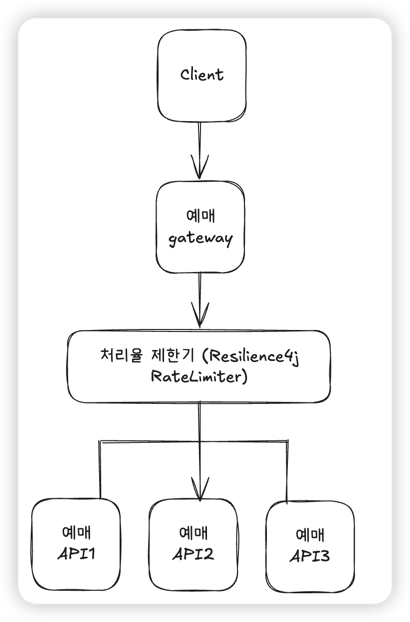
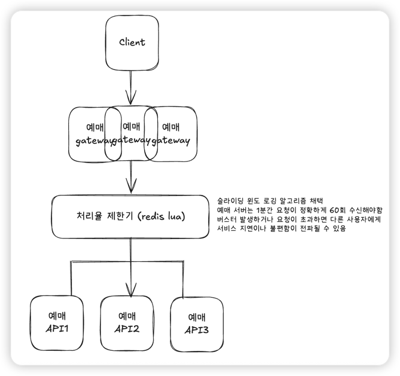

### 0. 문제
**[서비스 구조]**
- Client: 모바일/웹 사용자 (좌석 조회 및 예매 요청)
- API Gateway: 모든 외부 요청이 통과하는 입구, 처리율 제한 장치를 두어야 함
- Application Server: 좌석 조회, 예매, 결제 등 비즈니스 로직 처리
- Redis Cluster: 분산 환경에서 공유 가능한 카운터 저장소
- Database: 좌석 및 예매 내역 최종 저장소

**[상황]**
- 특정 API(예매 요청)는 사용자별로 1분에 최대 60회 요청만 허용해야 한다.
- 인기 콘서트 예매 시, 한 사용자가 초당 수백 건의 요청을 보내고 있음.
- 단일 서버 환경에서는 In-Memory 기반 Rate Limiter로 동작했지만,
- 서버가 3대로 늘어나자 동일 사용자가 동시에 3대 서버에 요청을 보내며 제한이 무력화됨.

**[문제]**
- in-Memory Counter는 서버별로 따로 유지 → 서버가 여러 대일 때 제한이 깨짐
-> 예: 3대 서버에서 각각 60회 허용 → 최대 180회까지 우회 가능
- Race Condition
-> 동시에 요청이 몰리면 Redis 카운터 증가/검증 시점 차이로 제한이 정확히 적용되지 않을 수 있음

위와 같은 문제점들을 정상적으로 처리할 수 있는 방법은??

### 1. 풀이 (게이트웨이 단일 인스턴스)

게이트웨이가 단일 인스턴스 구조이면, 서비스 규모가 큰 편은 아닐 것이다.  
이때는 서드파티(redis)를 사용하지않고 jvm 레벨에서 처리율 제한을 수행한다.  
단일 인스턴스일 때 `Resilience4j RateLimiter`를 사용하면 별도의 서드파티없이 jvm만으로 처리가 가능하다.  
고정 윈도우 방식이어서 60회를 1~2정도 초과할 수 있지만, 대부분 매크로 일 것으로 추측되기 때문에 요청만 거부하면 문제가 없을 것 같다 

게이트웨이 레벨에서 처리율 제한기를 추가하면 N개의 서버를 모두 대응할 수 있다.  
예매서버에 라우팅하기 전에 게이트웨이에서 사용자별로 요청이 가능한지 확인 후,  
윈도우 허용 범위에 있으면 라우팅을 시작한다

### 2. 풀이 (게이트웨이 수평확장 구조)

만약 정확히 60회를 보장해야하는 상황이라면 슬라이딩 윈도우 로깅 방식을 사용한다.
예매서버에서 지연이 발생할 경우 일반 사용자(매크로X)가 불편함을 느낄 수 있다.  
버킷/일반 윈도우 알고리즘은 순간적인 버스트와 시간의 경계로 60회를 초과할 수 있는 문제가 있다.

슬라이딩 윈도 알고리즘을 사용하면, 메모리 측면에서 누수가 있을 수 있지만 일반적인 상황에서 60회 요청이 불가능하다.  
예시로 한 좌석이 예매되면, 이미 동시성 처리를 거쳐 예약이 불가능해진 상황일 것이다.  
때문에 특정 사용자가 비정상적으로 많은 요청을 보내게되면 매크로일 확률이 높다.

게이트웨이가 N대이면 jvm만으로는 처리가 어렵기 때문에 redis lua 스크립트를 통해서 원자적 연산을 보장하고  
모든 게이트웨이 인스턴스가 동일한 값을 바라보도록 한다.
