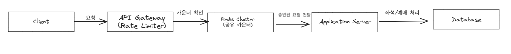

# 1. 문제

- 서비스 구조

  - **Client**: 모바일/웹 사용자 (좌석 조회 및 예매 요청)
  - **API Gateway**: 모든 외부 요청이 통과하는 입구, 처리율 제한 장치를 두어야 함
  - **Application Server**: 좌석 조회, 예매, 결제 등 비즈니스 로직 처리
  - **Redis Cluster**: 분산 환경에서 공유 가능한 카운터 저장소
  - **Database**: 좌석 및 예매 내역 최종 저장소

- 상황

  - 특정 API(예매 요청)는 사용자별로 1분에 최대 60회 요청만 허용해야 한다.
  - 인기 콘서트 예매 시, 한 사용자가 초당 수백 건의 요청을 보내고 있음.
  - 단일 서버 환경에서는 In-Memory 기반 Rate Limiter로 동작했지만,
  - 서버가 3대로 늘어나자 동일 사용자가 동시에 3대 서버에 요청을 보내며 제한이 무력화됨.
  

- 문제
  - in-Memory Counter는 서버별로 따로 유지 → 서버가 여러 대일 때 제한이 깨짐
  -> 예: 3대 서버에서 각각 60회 허용 → 최대 180회까지 우회 가능
  - Race Condition
  -> 동시에 요청이 몰리면 Redis 카운터 증가/검증 시점 차이로 제한이 정확히 적용되지 않을 수 있음
  - 위와 같은 문제점들을 정상적으로 처리할 수 있는 방법은??

- 풀이

- 모든 서버가 고용 Redis Cluster를 사용하여 서버가 여러 대여도 사용자에게 동일하게 60회 제한을 적용이 가능하며 Race Condition 방지

- 토큰 버킷 + 슬라이디 윈도우 활용
    - 1분에 60회를 초당 1개씩 리필되는 토큰으로 구현 
    - 실사용에서 분 단위 고정 윈도우의 경계효과를 피하고 슬라이딩 윈도우로 징밀하게 보정

