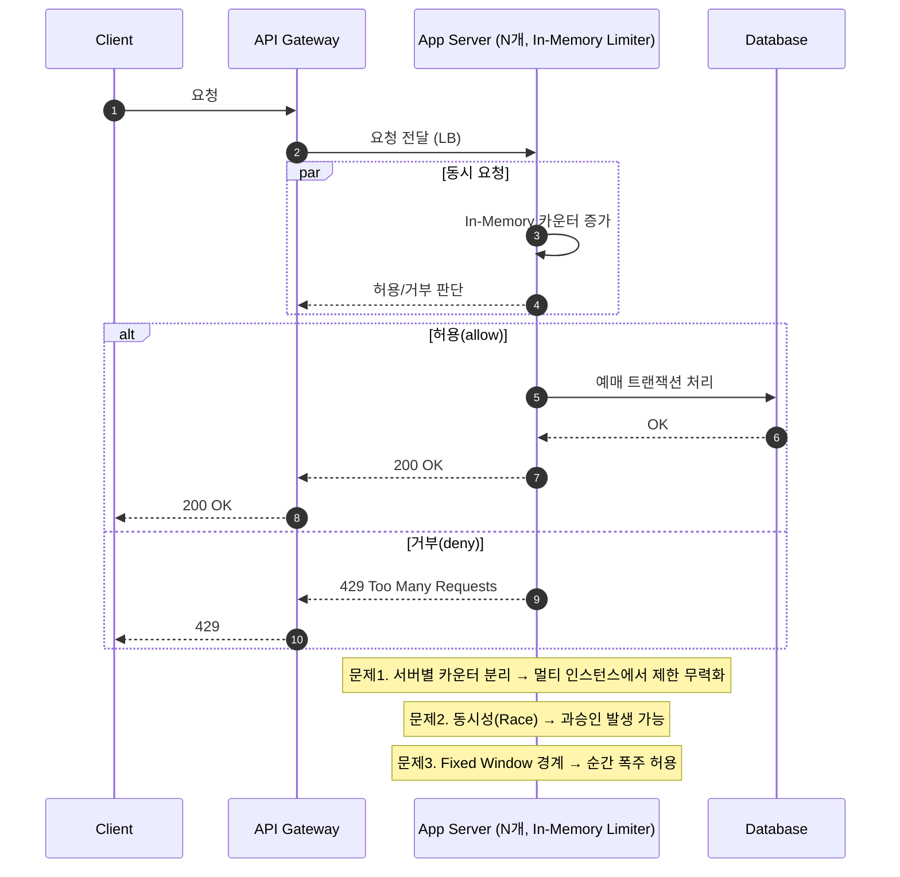

# 1. 문제

- 서비스 구조
    - **Client**: 모바일/웹 사용자 (좌석 조회 및 예매 요청)
    - **API Gateway**: 모든 외부 요청이 통과하는 입구, 처리율 제한 장치를 두어야 함
    - **Application Server**: 좌석 조회, 예매, 결제 등 비즈니스 로직 처리
    - **Redis Cluster**: 분산 환경에서 공유 가능한 카운터 저장소
    - **Database**: 좌석 및 예매 내역 최종 저장소

- 상황
    - 특정 API(예매 요청)는 사용자별로 1분에 최대 60회 요청만 허용해야 한다.
    - 인기 콘서트 예매 시, 한 사용자가 초당 수백 건의 요청을 보내고 있음.
    - 단일 서버 환경에서는 In-Memory 기반 Rate Limiter로 동작했지만,
    - 서버가 3대로 늘어나자 동일 사용자가 동시에 3대 서버에 요청을 보내며 제한이 무력화됨.

- 문제
    - in-Memory Counter는 서버별로 따로 유지 → 서버가 여러 대일 때 제한이 깨짐
      -> 예: 3대 서버에서 각각 60회 허용 → 최대 180회까지 우회 가능
    - Race Condition
      -> 동시에 요청이 몰리면 Redis 카운터 증가/검증 시점 차이로 제한이 정확히 적용되지 않을 수 있음
    - 위와 같은 문제점들을 정상적으로 처리할 수 있는 방법은??

## 1. 문제 원인 분석

- 문제의 본질은 단일 서버일 때는 In-Memory Counter 하나로 충분했지만 다중 서버가 되면서도 서버마다 카운터를 따로 유지한 것
    - 카운터를 서버마다 따로 관리함 -> 전체 합산이 되지 않아 60회 제한이 깨짐
- 즉, Race Condition은 서버별 분리된 환경에서는 아직 문제로 볼 필요가 없음
    - 단순히 카운터가 분리되어 있어 제한이 깨진 것
- 접근 방법: 문제를 독립적으로 생각

## 2. 해결 방안

1. 서버별 카운터 분리 -> 중앙 통합 카운터 도입
    - Redis를 활용하여 모든 서버에서 동일한 사용자 카운터 조회/증가
    - 서버 수와 관계없이 사용자별 60회 제한 적용 가능
    - 단, 동시에 요청이 몰리면 Redis 카운터 증가/검증 시점 차이로 제한이 정확히 적용되지 않아 Race Condition 발생
2. 처리율 제한 알고리즘 선정
    - 조건
        - 사용자별로 1분에 최대 60회 요청만 허용해야 한다
        - 사용자는 초당 수백 건의 요청이 가능
    - 고려 가능한 처리율 제한 알고리즘
        1. 토큰 버킷
            - burst 허용 가능
            - 순간 요청 폭주 대응에 유리
            - 단, 1분 딱 60회 제한에는 맞추기 어려움 (경계 burst 발생 가능)
        2. 누출 버킷
            - 처리 속도 일정, burst 제한
            - 순간 폭주를 일정 속도로 흘려보낼 수 있지만, 정확히 60회 제한 적용에 제약
        3. 고정 윈도 카운터
            - 단순 구현, 윈도 경계에서 순간 폭주 허용 → 인기 예매 상황에 부적합
        4. 이동 윈도 로그
            - 정확한 제한 가능, 로그 유지 비용 큼 → 인기 API 요청 시 성능 부담
        5. 이동 윈도 카운터
            - burst 허용 가능
            - 최근 1분 동안 요청 수 제한 가능

    - 결론
        - 이동 윈도 카운터 선택
            - 초당 많은 요청이 들어와도 최근 1분 총합 60회 내에서 정확히 허용
3. Race Condition 방지
    - 중앙 카운터에서 원자 연산 적용
        - Lua Script를 사용하여 오래된 요청 제거/최근 1분 요청 수 계산/검증/증가를 하나의 원자 연산으로 수행
        - 요청이 들어오면:
            - 먼저 오래된 요청(1분 이전) 제거
            - 남은 요청 수 계산
            - 60회 초과 시 → 거부(429)
            - 60회 이하 → 허용 및 카운터 증가

4. 결론
    1. 문제: 서버별 카운터 분리 → 60회 제한 무력화
    2. 해결: 중앙 통합 카운터 + 슬라이딩 윈도 카운터
        - 동시 요청으로 인한 Race Condition은 중앙 카운터와 Lua Script 원자 연산으로 방지