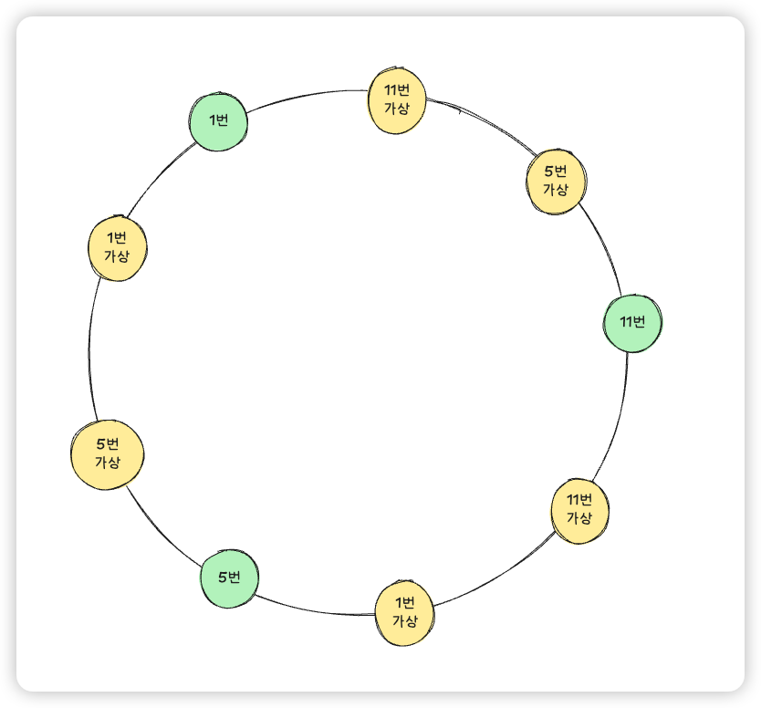

### 0. 문제
**서비스 구조**

- 모바일 앱 : "또타라커" 앱과 같이 지하철 내 물품을 보관할 수 있도록 사용자의 요청을 처리
- API Gateway : 모바일 앱 요청 처리
- Application Server : 각 출구별 보관함 관리 정보 처리
- MySQL 서버 : 각 출구별 보관함 정보 보관

**상황**

- 강남역 물품 보관함 구성 : 총 300개 보관함 (1번, 5번, 11번 출구에 각 100개씩)
  - A그룹 (A001~A100): 1번출구 MySQL에만 저장
  - B그룹 (B001~B100): 5번출구 MySQL에만 저장
  - C그룹 (C001~C100): 11번출구 MySQL에만 저장
- 5번 출구 시스템이 전체 다운되는 문제가 발생되어, B그룹 서비스가 중단되었다.
  - 이로 인해 B그룹 보관함 사용/조회가 불가하며 다른 출구에서 B그룹 데이터 조회/처리가 불가능한 상황이다.
  - 시스템 특징으로는 각 출구 시스템이 독립적으로 운영되어 출구 간에 데이터 공유, 백업이 존재하지 않는다.
  - 시스템 복구까지는 6시간 가량 소요될 예정으로 해당 시간 동안에는 관련 서비스 이용이 불가하다.
  
**문제**  
위의 상황을 마주한 상황에서 단일 출구 장애 시 다른 출구에서 B그룹 보관함 접근 가능하게 하는 등의 전체 서비스에 미치는 영향을 최소화하는 방법은?

### 1. 풀이
> 5번 출구의 데이터베이스가 다운될 때 1번과 11번에서 5번 데이터를 처리할 수 있어야 한다.  
> 단순히 해시알고리즘을 통해 데이터를 분산해두었다면, 이후 핫스팟 문제가 발생하여 데이터 불균형이 일어날 수 있다.   
> 이를, 해시링과 가상노드를 통해 해결한다.

- 각 서버별로 가상노드를 2개씩 추가하여 데이터 불균형을 방지한다. 
- 서비스 규모가 크지않다면, 단순 해시링과 해시키 방식으로 해결하여도 문제가 없을 수 있지만, 복구 후 재참여시 데이터 배치 문제가 있을 수 있다. 
- 이미지에선 공간상 2개의 가상노드를 가지고 있지만, 각 서버별로 8개의 노드를 보유하여 리밸런싱 발생할 때 I/O를 최소화 한다. 
- ** GPT피셜 데이터이동범위는 최소 1~4% 권장함 데이터 총량이 클수록 노드수가 적으면 리밸런싱 지연이 발생함
  - 이동범위 계산방법 
  - (서버수x가상노드수) = 총 가상노드 수
  - 슬롯당 비율 (1/총 가상노드수)