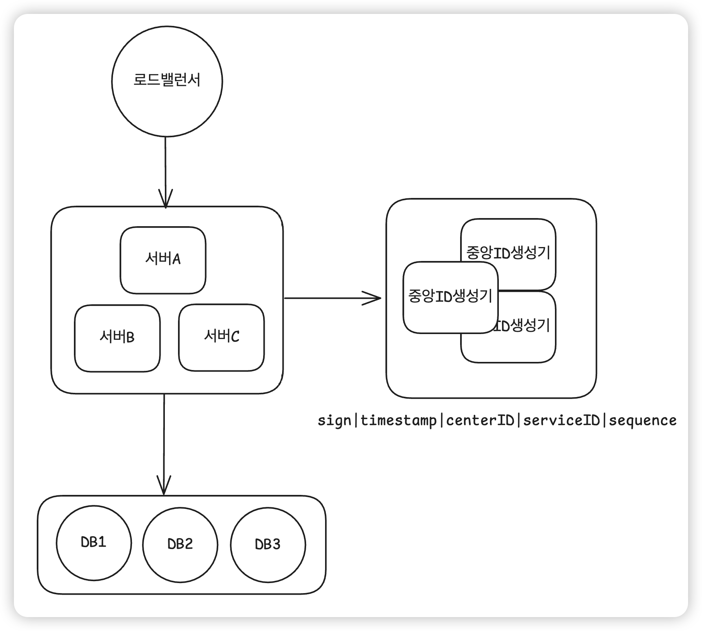

## 1. 배경

> 사용자 개인정보 수정 이력을 저장하는 Audit Log 시스템이 있다. 현재 시스템은 다음과 같이 동작한다:
> 
1. 여러 애플리케이션 서버가 로드밸런서를 통해 분산 요청을 처리한다.
2. 각 서버는 요청을 처리하면서 타임스탬프(yyyyMMddHHmmssSSS)를 문자열로 변환한 값을 사용하고, 이 값을 데이터베이스에 저장한다.
3. 그러나 데이터베이스에 Unique 제약이 없거나, 동일한 타임스탬프가 생성될 경우 중복 ID가 발생해 로그 정합성이 깨지는 문제가 생긴다.

## 2. 문제 상황 예시

- 동일 사용자 요청이 두 서버에서 같은 밀리초(ms) 안에 처리되면 동일한 ID가 생성되어 충돌한다.
- 그 결과 일부 로그는 중복 저장되거나, Unique 제약이 있을 경우 삽입 실패(409/500) 로 이어진다.
- 시간 순 정렬 기준이 깨져 “최신 이력” 판단이 틀리는 문제도 발생한다.

## 3. 요구사항

> 위 문제를 방지하기 위해, 분산 환경에서도 전역적으로 유일하고 정렬 가능한 ID를 생성하는 시스템을 설계하시오.
> 

**기능 요구사항**

- **전역 유일성(Global Uniqueness)**
    - 모든 서버에서 생성된 ID가 서로 중복되지 않아야 한다
- **정렬 가능성(Sortability)**
    - 시간 흐름에 따라 ID가 단조 증가해야 하며, 이력 정렬에 활용 가능해야 한다
- **재시도 및 충돌 처리 로직**
    - 동일 밀리초 내 충돌 시, sequence 증가 또는 재시도로 충돌 회피
- **운영 편의성**
    - 서버 증감이 유일 ID 시스템에 영향가지 않도록 설계할 것
- **대용량 트래픽 처리 성능**
    - 초당 20,000건 이상의 요청에서 충돌 없이 ID를 생성할 수 있어야 한다.

## 4. 풀이

> 스노우 플레이크 기법의 중앙 ID 생성기를 통해 분산 서비스의 ID 생성을 제어한다.
> 
> 비트 기반으로 ID를 생성하기 때문에 시간 순서로 정렬이 가능하고 적은 용량을 차지한다.
> 

### **4.1 인프라**

**4.1.1 구조**

- 애플리케이션 서버 (3대)
- 중앙ID생성기 (3대)
- DB (3대)

**4.1.2**

- **애플리케이션 서버:** 사용자의 요청 처리
    - ID 생성과 관련된 비즈니스를 알지 못하게 격리
    - ID 생성 책임은 “유일 ID 생성기”에서 담당
    - 샤드 맵을 통해 데이터베이스 ID를 조회하고 중앙 ID 생성기에 저장
- **중앙 ID 생성기 :** 유일 ID 생성
- **DB :** 데이터 저장 역할
    - 데이터베이스의 클러스터 구조를 샤드맵을 통해서 관리
    - 데이터베이스 구조가 변경되면 샤드맵을 수정하여 애플리케이션과 중앙 ID 생성기 싱크

### 4.2 상세

**4.2.1 일반 케이스**

1. 로드밸런서가 트래픽을 분산하면 서버는 요청을 수신하고 중앙 ID 생성기를 호출한다.
2. 중앙 ID 생성기는 전달받은 데이터베이스 ID를 통해 유일 ID를 생성한다. 
3. 애플리케이션은 반환받은 ID를 통해서 데이터를 저장

**4.2.2 재시도 케이스**

- 재시도는 애플리케이션에서 결정
- 중앙 ID 서버와의 타임아웃을 2s로 설정하고, 응답이 반환되지 않으면 1s 간격으로 3회 재시도 한다.
- 재시도 케이스가 잦으면 TPS 2만을 만족하기 어렵지만 자주 발생하는 것은 “중앙 ID 생성기”에  문제가 생긴 것으로 트러블 슈팅하는 것이 정상 케이스
    - 3대 스케일아웃 구조여서 3회 재시도가 번번히 실패하면 서버 문제 가능성

### 5. 요구사항 만족

- **전역 유일성(Global Uniqueness)**
    - 중앙 ID 생성기와 샤드맵을 통한 데이터베이스 ID를 통해 전역 유일성 만족
- **정렬 가능성(Sortability)**
    - 스노우 플레이크 기법을 사용하기 때문에 정렬가능함 (bit 구조)
- **재시도 및 충돌 처리 로직**
    - 동일 밀리초 충돌은 시퀀스로 방지함, 재시도는 애플리케이션에서 처리
- **운영 편의성**
    - 서버 증감은 해시맵만 변경하고 ID 생성 책임이 별도 모듈로 분리되어있어서 애플리케이션 영향 X
- **대용량 트래픽 처리 성능**
    - 모든 서버가 스케일아웃 구조이고 bit 단위의 ID 생성은 대용량 트래픽 처리에 용이 (잘 모름)

