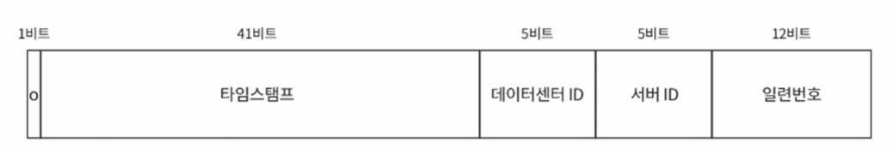

# 분산 환경에서 유일한 ID 생성기 설계

## 1. 배경

사용자 개인정보 수정 이력을 저장하는 **Audit Log 시스템**이 있다.  
현재 시스템은 다음과 같이 동작한다:

- 여러 애플리케이션 서버가 **로드밸런서**를 통해 분산 요청을 처리한다.
- 각 서버는 요청을 처리하면서 **타임스탬프(yyyyMMddHHmmssSSS)** 를 문자열로 변환한 값을 사용하고, 이 값을 데이터베이스에 저장한다.
- 그러나 데이터베이스에 Unique 제약이 없거나, 동일한 타임스탬프가 생성될 경우 **중복 ID**가 발생해 로그 정합성이 깨지는 문제가 생긴다.

## 2. 문제 상황 예시

동일 사용자 요청이 두 서버에서 같은 밀리초(ms) 안에 처리되면 동일한 ID가 생성되어 충돌한다.  
그 결과 일부 로그는 중복 저장되거나, Unique 제약이 있을 경우 **삽입 실패(409/500)** 로 이어진다.  
또한 시간 순 정렬 기준이 깨져 “최신 이력” 판단이 틀리는 문제도 발생한다.

## 3. 요구사항

위 문제를 방지하기 위해, **분산 환경에서도 전역적으로 유일하고 정렬 가능한 ID를 생성**하는 시스템을 설계해야 한다.

### 기능 요구사항

1. **전역 유일성(Global Uniqueness)**
   - 모든 서버에서 생성된 ID가 서로 중복되지 않아야 한다.

2. **정렬 가능성(Sortability)**
   - 시간 흐름에 따라 ID가 단조 증가해야 하며, 이력 정렬에 활용 가능해야 한다.

3. **재시도 및 충돌 처리 로직**
   - 동일 밀리초 내 충돌 시, sequence 증가 또는 재시도로 충돌 회피.

4. **운영 편의성**
   - 서버 증감이 유일 ID 시스템에 영향 가지 않도록 설계할 것.

5. **대용량 트래픽 처리 성능**
   - 초당 20,000건 이상의 요청에서 충돌 없이 ID를 생성할 수 있어야 한다.

## 해결 방향

본 문제를 해결하기 위해 **Twitter Snowflake 접근법**을 적용한다.  
Snowflake는 **전역적으로 유일하고 시간 순 정렬이 가능한 64비트 정수 ID**를 생성하는 알고리즘으로,  
중앙 서버 없이도 각 서버에서 독립적으로 고유 ID를 생성할 수 있다.

## 동작 방식 (Flow)

1. 현재 시각(`now = System.currentTimeMillis()`)을 가져온다.
2. 직전 ID 생성 시각(`lastTimestamp`)과 비교한다.
   - **같은 ms**라면 `sequence` 값을 +1 증가시킨다.
   - **다른 ms**라면 `sequence`를 0으로 초기화한다.
3. `sequence`가 4096(=2¹²)개를 초과하면 → 다음 밀리초로 넘어갈 때까지 대기(`waitNextMillis()`).
4. 41비트 시간 값과 5비트 데이터센터 ID, 5비트 워커 ID, 12비트 시퀀스를 비트 시프트로 결합한다.
5. 최종적으로 `64비트 정수 ID`를 반환한다.

##  기능 요구사항 충족 검증

#### 1. 전역 유일성 (Global Uniqueness)

> **요구사항:**  
> 모든 서버에서 생성된 ID가 서로 중복되지 않아야 한다.

- ID는 `timestamp(41)` + `datacenterId(5)` + `workerId(5)` + `sequence(12)` 의 비트 조합으로 구성된다.
- 각 서버(워커)는 고유한 `workerId`를 가지므로,  
  동일한 시간(`timestamp`)과 동일한 시퀀스(`sequence`) 값을 생성하더라도  
  **전역적으로 중복되지 않는다.**
- 데이터센터나 서버 ID 중복만 방지하면, 유일한 ID 발급이 가능하다.

---

#### 2. 정렬 가능성 (Sortability)

> **요구사항:**  
> 시간 흐름에 따라 ID가 단조 증가해야 하며, 이력 정렬에 활용 가능해야 한다.

- ID의 상위 비트가 `timestamp`로 구성되어 있어,  
  **시간이 지날수록 ID의 숫자 값이 커지는 구조**이다.
- 같은 밀리초(ms) 안에서는 `sequence` 값이 증가하므로  
  **시간 + 시퀀스 조합**으로 정렬이 가능하다.

---

#### 3. 재시도 및 충돌 처리 로직

> **요구사항:**  
> 동일 밀리초 내 충돌 시, sequence 증가 또는 재시도로 충돌 회피해야 한다.

- 같은 밀리초(ms) 안에서 여러 요청이 발생하면,  
  `sequence` 값을 1씩 증가시켜 중복을 회피한다.
- `sequence`는 12비트(0~4095)로 구성되어 있어,  
  **한 서버가 1ms 내에 최대 4096개의 ID**를 생성할 수 있다.
- 4096개를 초과하면 `waitNextMillis()` 메서드를 통해  
  **다음 밀리초로 넘어갈 때까지 대기 후 재시도**한다.

---

#### 4. 운영 편의성 (Operational Flexibility)

> **요구사항:**  
> 서버 증감이 유일 ID 시스템에 영향 가지 않도록 설계할 것.

- 서버마다 **고유한 `workerId`** 를 부여받기 때문에  
  서버 증설이나 축소가 발생해도 기존 ID 시스템에는 영향이 없다.
- 새로운 서버를 추가해도 고유 `workerId`만 다르게 설정하면  
  즉시 서비스에 투입 가능하다.
- 별도의 중앙 시퀀스 서버나 락(lock) 관리가 필요하지 않아  
  **운영이 단순하고 확장성(Scalability)이 높다.**

---

#### 5. 대용량 트래픽 처리 성능 (High Throughput)

> **요구사항:**  
> 초당 20,000건 이상의 요청에서 충돌 없이 ID를 생성할 수 있어야 한다.

- 12비트 시퀀스로 인해 **1ms당 최대 4096개의 ID**를 생성 가능.  
  → 즉, **초당 약 4,096,000건(≈ 400만 건)** 까지도 처리 가능.

