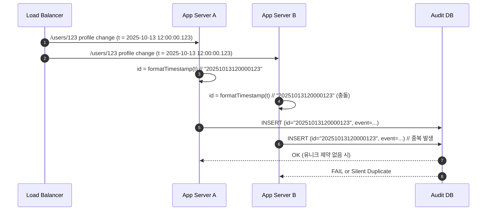

## 문제 : 분산 환경에서 유일한 ID 생성기 설계

### 1. 배경
> 사용자 개인정보 수정 이력을 저장하는 Audit Log 시스템이 있다. 현재 시스템은 다음과 같이 동작한다:

1. 여러 애플리케이션 서버가 로드밸런서를 통해 분산 요청을 처리한다.
2. 각 서버는 요청을 처리하면서 타임스탬프(yyyyMMddHHmmssSSS)를 문자열로 변환한 값을  사용하고, 이 값을 데이터베이스에 저장한다.
3. 그러나 데이터베이스에 Unique 제약이 없거나, 동일한 타임스탬프가 생성될 경우 중복 ID가 발생해 로그 정합성이 깨지는 문제가 생긴다.

### 2. 문제 상황 예시
> 동일 사용자 요청이 두 서버에서 같은 밀리초(ms) 안에 처리되면 동일한 ID가 생성되어 충돌한다.
> 그 결과 일부 로그는 중복 저장되거나, Unique 제약이 있을 경우 삽입 실패(409/500) 로 이어진다.
> 시간 순 정렬 기준이 깨져 “최신 이력” 판단이 틀리는 문제도 발생한다.

### 3. 요구사항
> 위 문제를 방지하기 위해, 분산 환경에서도 전역적으로 유일하고 정렬 가능한 ID를 생성하는 시스템을 설계하시오.

**기능 요구사항**
1. **전역 유일성(Global Uniqueness)**
    - 모든 서버에서 생성된 ID가 서로 중복되지 않아야 한다
2. **정렬 가능성(Sortability)**
    - 시간 흐름에 따라 ID가 단조 증가해야 하며, 이력 정렬에 활용 가능해야 한다
3. **재시도 및 충돌 처리 로직**
    - 동일 밀리초 내 충돌 시, sequence 증가 또는 재시도로 충돌 회피
4. **운영 편의성**
    - 서버 증감이 유일 ID 시스템에 영향가지 않도록 설계할 것
5. **대용량 트래픽 처리 성능**
    -  초당 20,000건 이상의 요청에서 충돌 없이 ID를 생성할 수 있어야 한다.

## 1. 문제 원인
- ID 생성 방식이 타임스탬프(yyyyMMddHHmmssSSS) 문자열에 의존
  - 밀리초 단위까지만 표현하므로, 동일한 밀리초에 여러 요청이 들어오면 중복 ID가 발생
- DB Unique 제약은 중복을 막을 수 있지만, 근본 원인을 해결하지 못함
  - Unique 제약이 있다면 INSERT 충돌(409/500) 발생
  - Unique 제약이 없다면 로그 중복 저장 → 정합성 깨짐
## 2. 해결 방안 설계
### 2-1. ID 충돌 방지
1. 타임스탬프 + 서버 ID
   - 타임스탬프에 서버 ID를 결합함으로써 서버 간 중복 방지
   - 요구사항 적합성
     - 같은 서버에서는 여전히 중복이 발생할 수 있어 **전역 유일성**을 만족하지 못함
2. 타임스탬프 + 서버 ID + sequence
   - 동일한 밀리초 단위의 요청이 발생해도 시퀀스를 통해 중복 없이 ID 생성 가능
   - 요구사항 적합성
     - **전역 유일성**과 **정렬 가능성**을 모두 만족
### 2-2. 재시도/충돌 회피 전략
1. 동일 밀리초 내 충돌 처리
   - 동일 서버에서 같은 밀리초에 여러 요청이 들어오는 경우, 시퀀스를 증가시켜 중복 ID 생성 방지
2. DB 삽입 실패 시 재시도
   - DB INSERT 시 중복에 의한 충돌이나 기타 이유로 인해 실패가 발생하면, 재시도 로직으로 처리
### 2-3. 서버 ID 삽입 방식
1. EC2 환경변수 사용
   - 서버 기동 시 환경변수나 설정 파일(YML, properties 등)을 통해 서버 ID를 주입
   - 장점: 구현이 단순함
   - 단점: 서버 운영자가 수동으로 ID를 관리해야 함
     - 오토 스케일링 환경이라면 ID 자동화 필요
2. 기타 자동화 방식
    - EC2 instance-id 기반 해시
    - 중앙 ID 처리기 활용
## 3. 구현 방향 설계
1. 동기 처리
   - 사용자가 개인정보 수정 요청 → 서버에서 DB에 개인정보 수정 수행
   - 로그 삽입 동기 처리 흐름
     1. 요청의 타임스탬프를 미리 확보
     2. ID 생성
        - `generateId(currentMillis)`로 표기
          - synchronized or CAS 사용
            - 동시 접근 시 안전 보장
          - 타임스탬프 + 서버 ID + sequence 형식으로 ID 구성
          - 내부에서 시퀀스 관리
            - 동일 밀리초: 시퀀스 증가
            - 다른 밀리초: 시퀀스 초기화
     3. 로그 DB 삽입
        - 성공 시 완료
        - 실패 시, 로그 삽입 재시도는 비동기 처리 큐로 위임
   - 추가 고려 사항
     - 결론 부분 참고
2. 비동기 처리(재시도)
   - 로그 삽입 실패 시 해당 요청 정보(타임스탬프, 사용자 정보 등)를 비동기 큐에 담아 재시도
     - 요청을 순서대로 처리하여 `generateId(currentMillis)` 호출 시 시퀀스 단절 방지
   - 재시도 흐름
     1. `generateId(currentMillis)` 호출
     2. DB 삽입 재시도
        - 실패하면 제한 횟수 내에서 재시도 및 백오프 적용
        - 최대 재시도 횟수 초과 시, 실패 사실을 별도의 로그/모니터링 기록으로 남김
## 4. 결론 및 추가 확인 사항
- 현재 설계된 ID 생성 구조는 기능 요구사항을 충족하도록 구성됨
- 다만 실제 운영 환경에서는 다음 사항에 대한 추가 검증이 필요함
  1. 동기 처리 시 `generateId(currentMillis)` 병목 가능성
     - 동기 로직과 비동기 로직에서 각각 ID를 생성하고 있어 시퀀스 단절이 발생할 수 있음
     - 로그 삽입 자체를 비동기 큐로 완전히 위임하고, 동기 로직에서는 타임스탬프, 사용자 정보만 전달하는 구조로 변경하는 것이 적절할 수 있음
  2. 재시도 전략 및 백오프 설정
     - 실패 요청 재시도 시 적절한 간격과 최대 재시도 횟수를 설정하여 시스템 과부하 방지