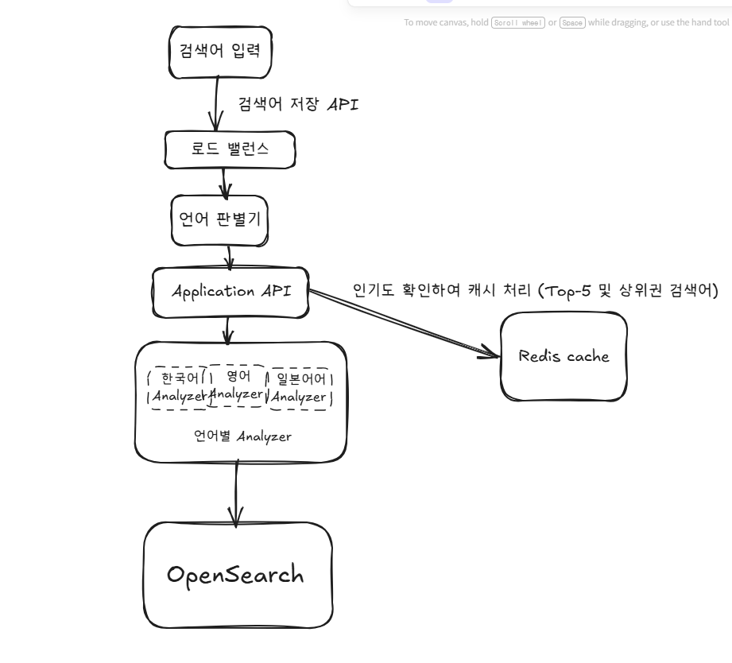
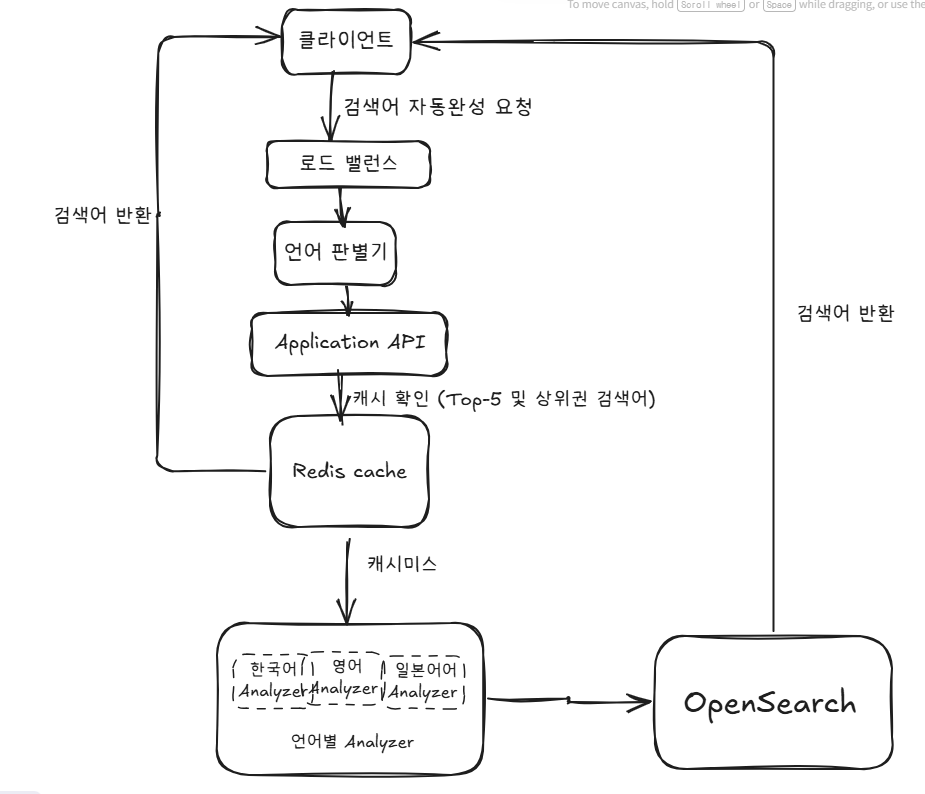

# 검색어 자동완성 시스템 설계

## 1. 문제
### 배경
> - 당신은 글로벌 서비스용 검색어 자동완성 시스템 설계자입니다.
> - 다양한 언어를 지원하며, 천만 명 이상의 사용자가 동시에 이용하는 대규모 서비스로, 빠르고 정확한 자동완성 기능 제공이 핵심입니다.

### 요구사항
- **트래픽 규모**
    - DAU(Daily Active Users)가 천만 명으로 대규모 트래픽을 감당할 수 있어야 합니다.
- **다국어 지원**
    - 한국어, 영어, 일본어 등 여러 언어를 지원해야 합니다.
- **자동완성 검색어 일치 범위**
    - 사용자가 입력하는 단어가 자동완성 될 검색어의 시작 부분이거나 중간 부분에 위치할 수 있습니다.
- **빠른 응답 속도**
    - 사용자 입력에 따라 최대 100ms 이내에 자동완성 결과가 반환되어야 합니다.
- **추천 결과 수**
    - 화면에 5개의 자동완성 검색어가 표시되어야 합니다.
- **인기 변동 반영 (선택 사항)**
    - 특정 검색어의 인기가 갑자기 높아지는 경우, 해당 인기도 변화가 실시간 혹은 근접 실시간으로 자동완성에 반영되어야 합니다. (10분 이내 반영)

## 2. 풀이
> 각 언어별 OpenSearch Analyzer + Redis 이용한 캐시 처리

> 데이터 저장 후 인덱싱 처리
> - 검색어 입력시 언어 판별후에 각 언어에 맞는 Analyzer 이용하여 유니코드로 저장
    >   - ex) Java 입력 -> j,a,v,a, ja,av, va, jav, ava, java 로 저장 (lowercase, n-gram)
> - 인기도 같은 수치를 함께 저장해 Top-N 정렬 및 캐시 갱신시 사용

> 데이터 입력시
> - 1차 캐시(Redis) 조회
> - 1차 캐시에 없다면 OpenSearch 조회 후 응답
> - 인기도 수치 이용하여 캐싱 여부 결정

1. OpenSearch analyzer 사용
2. n-gram tokenizer 사용  >> 자동완성 검색어 일치 범위 충족
3. 유니코드로 저장, 언어별 analyzer 를 따로 사용   >> 다국어 지원 충족
4. Redis 이용한 Top-5 캐시 이용  >> 추천 결과 수 충족